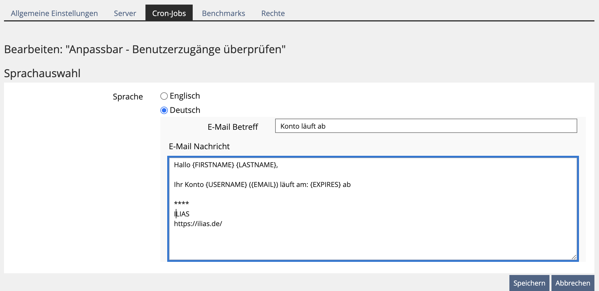
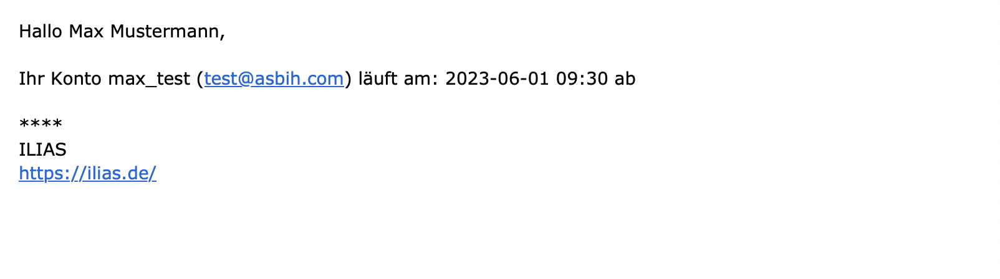

# CustomUserCronCheckAccounts
CustomUserCronCheckAccounts is a plugin for the [ILIAS](https://www.ilias.de/) Learning Management System, which extends the default ILIAS "check user accounts" Cronjob,
to allow you to customize the email/notification message sent to the user.

## Version
v1.0.1

## Screenshots
* This is the default ILIAS Message


* This is the one generated from the plugin




## Installation
In your {ILIAS Root} directory
```bash
mkdir -p Customizing/global/plugins/Services/Cron/CronHook
cd Customizing/global/plugins/Services/Cron/CronHook
git clone https://github.com/iFadi/CustomUserCronCheckAccounts.git
```

to list the plugin under "Administration" > "Plugins", you should run in your {ILIAS Root}:
```bash
composer du --no-dev
```

After activating the plugin, a new cronjob "Customizable - Check user accounts" should appear. You should also deactivate the default ILIAS "Check user accounts" Cronjob.

#### Parameters which can be used in the text subject/body
* {USERNAME}
* {EMAIL}
* {FIRSTNAME}
* {LASTNAME}
* {EXPIRES}

## Tested on the following ILIAS Versions:
* v8.0
* v8.99

PS: For older ILIAS versions, you can choose to use older tags/versions of the plugin.

## Maintainer
[ZQS/elsa - Leibniz Universität Hannover](https://www.zqs.uni-hannover.de/de/zqs/team-kontakt/elsa/), [elearning@uni-hannover.de](mailto:elearning@uni-hannover.de)

